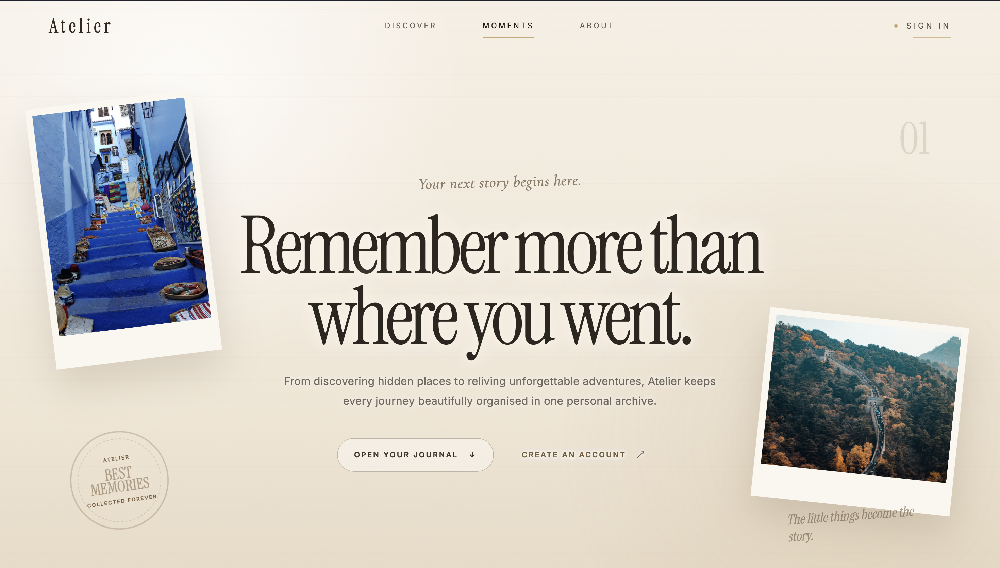

# ✈️ Atelier

> **Curated experiences. Beautiful memories.**

Atelier is a cinematic travel planner and digital memory journal designed for travellers who believe the best trips aren't measured by how many places you visit but by the memories you bring home !! <3

Instead of spending hours searching through Instagram, TikToks and Google Maps, Atelier creates thoughtful travel experiences based on your destination, available time, budget and interests. Once your adventure is over, your journey becomes part of your own beautifully organised digital journal. It's pretty cool if i do say so myself!

---

## Features

- 🌍 Discover personalised travel experiences
- 🗓️ Generate curated itineraries
- 💰 Plan around your available time and budget
- 📖 Save journeys to a digital memory journal
- 🖼️ Browse memories through destination albums
- 🔐 Create an account and sign in
- 💾 Data saved using Local Storage
- 📱 Fully responsive design
- 🎨 Cinematic, editorial-inspired user interface
- 🥚 Hidden easter eggs throughout the experience

---

## Built With

- HTML5
- CSS3
- JavaScript (ES6)
- Local Storage API

---

## Getting Started

### Clone the repository

```bash
git clone https://github.com/iimanomar/atelier.git
```

### Open the project

Navigate into the project folder and open `index.html` using **Live Server** in Visual Studio Code.

---

## How to Use Atelier

1. Explore the homepage.
2. Learn about Atelier.
3. Create your traveller account.
4. Discover personalised experiences.
5. Save your journey.
6. Revisit your adventures anytime in **Moments**.

---

##  Where Atelier Goes Next

Future ideas for the project include:

- 📸 Upload personal travel photos
- 🗺️ Interactive maps
- 🤖 AI-powered itinerary recommendations
- ☁️ Cloud account syncing
- ❤️ Favourite destinations
- 🌍 Share memories with friends

---

## 📷 Screenshots
### Homepage


### Moments




---

## Author

**Iman Omar**

Software Engineering Student  
Moringa School

GitHub: https://github.com/iimanomar

---

## Final Note

Atelier started as a front-end project and gradually evolved into something much bigger!! Basically a place where travel planning meets storytelling.

The goal wasn't simply to build another itinerary planner, but to create an experience that feels calm, thoughtful and memorable. Every page was designed to feel like opening a beautifully curated travel journal, proving that sometimes the journey of building something can be just as rewarding as the journey itself.

Happy exploring. ✈️